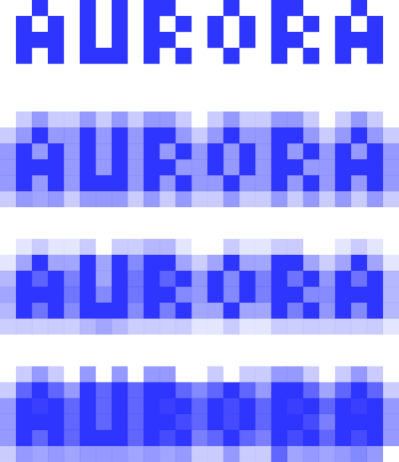
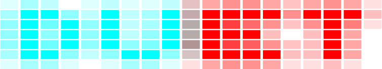
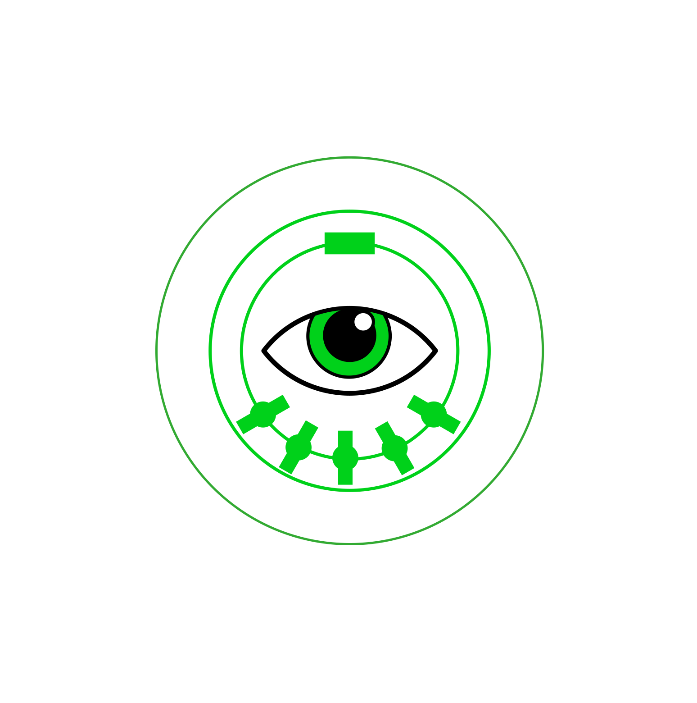
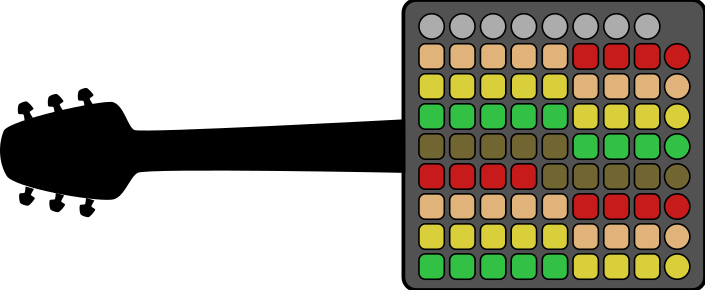
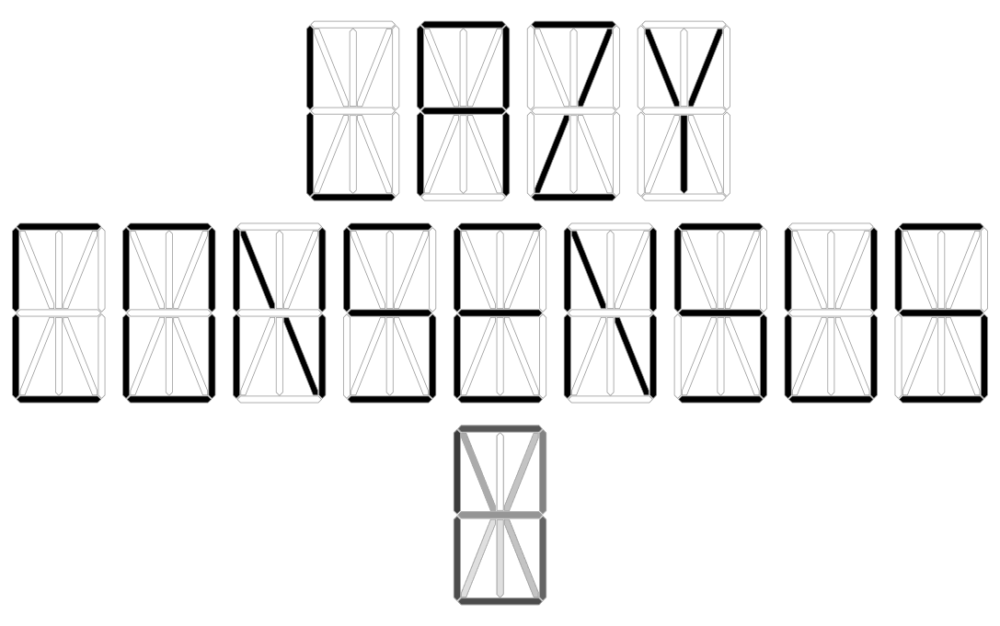
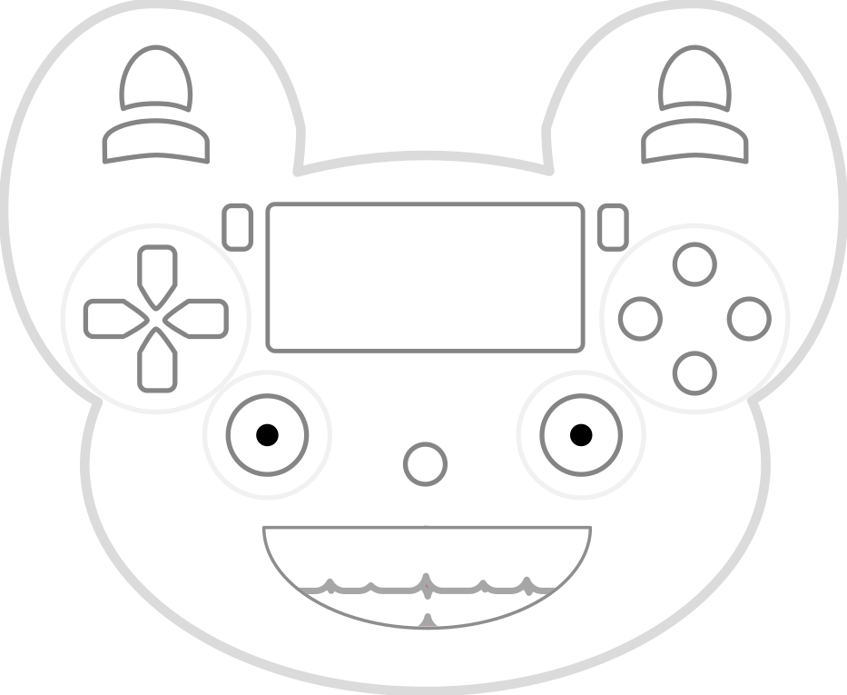

# Demos

This page collects recent work with MIDI and game controllers.  For most of the examples you will need a connected
MIDI device (software or hardware) to hear any sound.

## Demos for MIDI Controllers

### Aurora

The ["Aurora"](./flocking-midi-interchange/demos/aurora.html) compliments a Launchpad Pro by playing a coloured "aura"
on and around any played notes.

### Bifrost

The ["Bifrost"](./flocking-midi-interchange/demos/bifrost.html) guides the user by only allowing notes to be played that
would form a chord with the notes that are already held.

### Cheatar

The [original version of the Cheatar](./cheatar/index.html) was designed to run on the touchscreen of a Raspberry Pi and
be used with a Korg Nanopad 2.  It can also be used onscreen.

The ["nano" cheatar](./cheatar/nano.html) is a later effort where you strum the x/y pad of a Korg Nanopad to play
guitar chords.  You'll need a MIDI controller to use it.

### Duet

The ["Duet"](./flocking-midi-interchange/demos/duet.html) only plays notes that are held on two connected MIDI
controllers at the same time.  Requires two MIDI controllers.

### "Eye of AgaMIDI"

The ["Eye of AgaMIDI"](./eye-of-agamidi/index.html) moves a MIDI clock forward and backwards based on MIDI control
codes.  You must connect this to an instrument that supports clock messages to use this, such as a sequencer.

### Flockquencer

The ["Flockquencer"](./flockquencer/index.html) is a prototype for a sequencer based on the Novation Launchpad.  It can
also be played using the onscreen controls.

### Launchpad Guitar

The [Launchpad Guitar](./launchpad-guitar/index.html) retunes a Novation Launchpad to play like a guitar, i.e. the first
note in each column corresponds to the open note played by one string of a guitar in standard tuning. It's also playable
onscreen.

### Launchpad Pro Guitar

The [Launchpad Pro Guitar](./flocking-midi-interchange/demos/launchpad-pro.html) retunes a Novation Launchpad Pro to
play like a guitar.  The pads are lit to match the colour scheme used by the guitar learning game Rocksmith.

### Laser Screwdriver

The ["Laser Screwdriver"](./flocking-midi-interchange/demos/laser-screwdriver.html) retunes a Novation Launchpad or
Launchpad Pro to use a [tonnetz](https://en.wikipedia.org/wiki/Tonnetz) isometric tuning.

### Lazy Consensus

The ["Lazy Consensus"](./flocking-midi-interchange/demos/lazy-consensus.html) only plays a single note based on the
average pitch of all held notes.  Requires a MIDI controller.

### LPiano

This project contains early piano (keyboard controller) centered experiments in visualising and teaching piano tunes.
The ["Note Transcriber"](./lpiano/tests/static/noteTranscriber.html) transcribes the notes played in real time. The
["Scorer"](./lpiano/tests/static/scorer.html) displays a musical score where the highlighting advances only when
you play the correct next note.

### "MIDI RTL"

The ["MIDI RTL"](./midi-rtl/index.html) is a simple instrument that "mirrors" the pitch around a particular note.  So,
instead of the pitch rising from left to right, it rises from right to left.  Very fun to use with familiar tunes.

### "MIDI Microtoner"

The [MIDI Microtoner](./flocking-midi-microtoner/index.html) splits a single MIDI input into channels and uses
pitchbend to simulate octaves that consist of far more than 12 notes.

## Gamepad Demos

### Analog Stick Theremin

The [Analog Stick Theremin](./gp2m/analog-stick-theremin.html) uses the analog thumbpads on a game controller to send
control messages that can simulate a theremin.  You will need something like VCV Rack to meaningfully use this.

###  Gamepad MIDI Clock

The [Gamepad MIDI Clock](./gp2m/gamepad-midi-clock.html) sends MIDI clock messages whenever a button or thumbpad is
pressed on a controller.  You must connect this to an instrument that supports clock messages, such as a sequencer.

### PS4chestra

The ["PS4chestra"](./gp2m/ps4chestra.html) is a musical instrument and animated character controlled using a PS4
controller (it should also work with any other controller, but the tuning may be off).  There's also an
[alternate version I made for Halloween](./gp2m/halloween.html).
