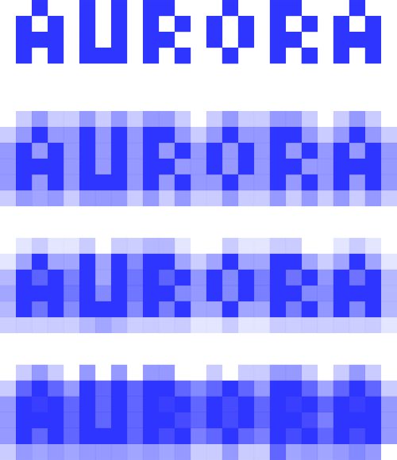
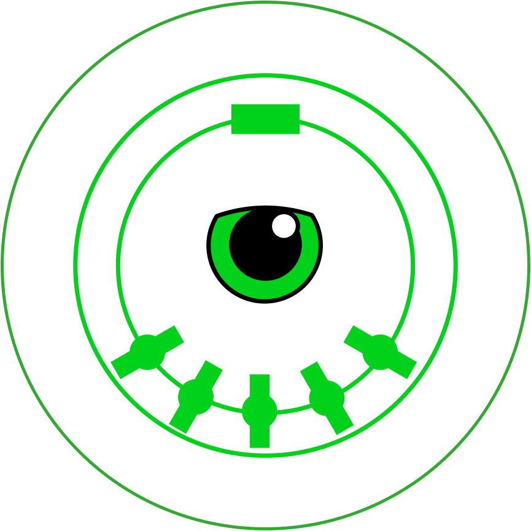

# Demos

This page collects recent work with MIDI and game controllers. For most of the examples you will need a connected
MIDI device (software or hardware) to hear any sound.

## Demos for MIDI Controllers

### Aurora

The ["Aurora"](./flocking-midi-interchange/demos/aurora.html) compliments a Launchpad Pro by playing a coloured "aura"
on and around any played notes. The non-playing controls at the bottom of the launchpad change the colour scheme.

### Bifrost

The ["Bifrost"](./flocking-midi-interchange/demos/bifrost.html) guides the user by only allowing notes to be played that
would form a chord with the notes that are already held. Like the "Aurora", the non-playing controls at the bottom of
the launchpad change the colour of highlighted lights.

### Cheatar

The "cheatar", or "cheater's guitar" is designed to emulate strummed guitar chords using a MIDI controller.

The [original version of the Cheatar](./cheatar/index.html) was designed to run on the touchscreen of a Raspberry Pi and
be used with a Korg Nanopad 2. It can also be used onscreen. The strum algorithm was loosely adapted from observing
various modes of the Oberheim Strummer.

The ["nano" cheatar](./cheatar/nano.html) is a later effort where you strum the x/y pad of a Korg Nanopad to play
guitar chords. You'll need a MIDI controller to use it, ideally one with an x/y pad.

### Duet

The ["Duet"](./flocking-midi-interchange/demos/duet.html) only plays notes that are held on two connected MIDI
controllers at the same time. Requires two MIDI controllers.

The "Duet" can be used in a few ways:

1. Coordinating between two players on separate instruments.
2. A single player coordinating both of their hands on separate instruments.
3. Coordinating between multiple sequncers to create more complex patterns that represent only the moments at which they
   both attempt to play the same note.

### "Eye of AgaMIDI"

The ["Eye of AgaMIDI"](./eye-of-agamidi/index.html) moves a MIDI clock forward and backwards based on MIDI control
codes.  An instrument that supports clock messages interprets these clock messages and plays its notes forwards or
backwards at the selected speed in response. Best used as input to a sequencer.

### Flockquencer

The ["Flockquencer"](./flockquencer/index.html) is a prototype for a sequencer based on the Novation Launchpad. It can
also be played using the onscreen controls.

### Launchpad Guitar

The [Launchpad Guitar](./launchpad-guitar/index.html) retunes a Novation Launchpad to play like a guitar, i.e. the first
note in each column corresponds to the open note played by one string of a guitar in standard tuning. It's also playable
onscreen.

### Launchpad Guitar Pro

The [Launchpad Guitar Pro](./flocking-midi-interchange/demos/launchpad-pro.html) retunes a Novation Launchpad Pro to
play like a guitar. The pads are lit to match the colour scheme used by the guitar learning game Rocksmith.

### Launchpad Pong

[Launchpad Pong](./flocking-midi-interchange/demos/launchpad-pong.html) presents a "ball" that is played as a note. The
ball moves around in response to the pads the user hits on a connected Launchpad Pro.

### Launchpad Pong (Multiball)

[The "multiball" version of Launchpad Pong](./flocking-midi-interchange/demos/launchpad-pong.html) adds support for
multiple "balls" simultaneously, and rules for how they collide with each other.

### Laser Screwdriver

The ["Laser Screwdriver"](./flocking-midi-interchange/demos/laser-screwdriver.html) retunes a Novation Launchpad or
Launchpad Pro to use a [tonnetz](https://en.wikipedia.org/wiki/Tonnetz) isometric tuning. In an isometric tuning, once
you find a shape that corresponds to a chord, you can use that same shape to make the same type of chord in any relative
position.

### Lazy Consensus

The ["Lazy Consensus"](./flocking-midi-interchange/demos/lazy-consensus.html) only plays a single note based on the
average pitch of all held notes. Among other things:

1. Inadvertently hitting multiple buttons still results in a single clean tone.
2. Playing on a device such as the Arturia Beatstep results in a kind of bouncing

### LPiano

This project contains early piano (keyboard controller) centered experiments in visualising and teaching piano tunes.
The ["Note Transcriber"](./lpiano/tests/static/noteTranscriber.html) transcribes the notes played in real time. The
["Scorer"](./lpiano/tests/static/scorer.html) displays a musical score where the highlighting advances only when
you play the correct next note.

### "MIDI RTL"

The ["MIDI RTL"](./midi-rtl/index.html) is a simple instrument that "mirrors" the pitch around a particular note. So,
instead of the pitch rising from left to right, it rises from right to left. Very fun to use with familiar tunes.

### "MIDI Microtoner"

The [MIDI Microtoner](./flocking-midi-microtoner/index.html) splits a single MIDI input into channels and uses
pitchbend to simulate octaves that consist of far more than 12 notes.

### "Nano Gurdy"

A software instrument that simulates a hurdy gurdy

### "Patchbay"

The ["patchbay"](./flocking-midi-interchange/demos/patchbay.html) provides a simple means of adding routings between one or more MIDI devices.

### "Polar Vortex"

The ["polar vortex"](./flocking-midi-interchange/demos/polar-vortex.html) is a polar-coordinate based instrument in
which each note is tracked by its angle relative to the centre and distance from the centre. The centre
can be configured to attract or repel notes, and rotation is also configurable. The state of the notes is quantised
into a grid that is displayed onscreen and also on a connected Launchpad Pro.

## Gamepad Demos

### Analog Stick Theremin

The [Analog Stick Theremin](./gp2m/analog-stick-theremin.html) uses the analog thumbpads on a game controller to send
control messages that can simulate a theremin. You will need something like VCV Rack to meaningfully use this.

###  Gamepad MIDI Clock

The [Gamepad MIDI Clock](./gp2m/gamepad-midi-clock.html) sends MIDI clock messages whenever a button or thumbpad is
pressed on a controller. You must connect this to an instrument that supports clock messages, such as a sequencer.

### PS4chestra

The ["PS4chestra"](./gp2m/ps4chestra.html) is a musical instrument and animated character controlled using a PS4
controller (it should also work with any other controller, but the tuning may be off). There's also an
[alternate version I made for Halloween](./gp2m/halloween.html).
